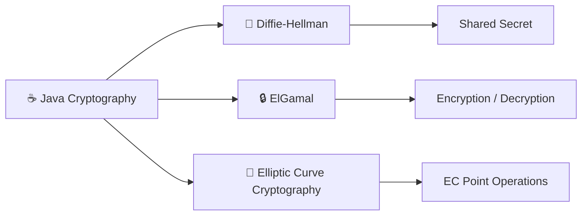

# Cryptography Algorithms in Java 🔐☕

A collection of Java implementations created to explore the programming and mathematical concepts behind public-key cryptography.

The project includes work with **Diffie-Hellman key exchange, ElGamal encryption, and elliptic-curve cryptography (ECC)**.

## Cryptographic Concepts



## What's Included

### 🔑 Diffie-Hellman

Explores the process of establishing a shared secret between two parties using public values without directly transmitting the shared secret itself.

### 🔒 ElGamal

Explores public-key encryption and decryption using the mathematical concepts behind the ElGamal cryptosystem.

### 📐 Elliptic-Curve Cryptography

Explores elliptic-curve cryptography and the use of elliptic-curve point operations in cryptographic systems.

## Technologies & Concepts

`Java` `Cryptography` `Diffie-Hellman` `ElGamal` `ECC` `Public-Key Cryptography`

Concepts explored in this project include:

- Public and private keys
- Shared-secret generation
- Encryption and decryption
- Modular arithmetic
- Cryptographic algorithms
- Elliptic-curve operations

## Project Structure

```text
cryptography-algorithms-java/
│
├── src/
│   └── Java source files
│
└── README.md
```

The Java implementations are located in the `src` directory.

## Running the Project

Clone the repository:

```bash
git clone https://github.com/strawberry-frog/cryptography-algorithms-java.git
```

Move into the project directory:

```bash
cd cryptography-algorithms-java
```

The individual Java source files can then be compiled and run using a Java Development Kit (JDK).

For example:

```bash
javac src/FileName.java
java -cp src FileName
```

Replace `FileName` with the name of the Java class you want to run.

## Why I Built This

I created these implementations while learning how cryptographic algorithms work beyond just calling an existing encryption library.

Writing the algorithms in Java gave me a better understanding of the mathematics and logic involved in key exchange, public-key encryption, and elliptic-curve cryptography.

## Notes

This repository is intended for **educational purposes** and demonstrates cryptographic concepts rather than production-ready cryptographic software.

Real applications should use established and thoroughly tested cryptographic libraries instead of custom implementations.

---

```text
      🔑  +  ☕  +  math
             |
             v
      learning crypto
      one algorithm
        at a time
```
